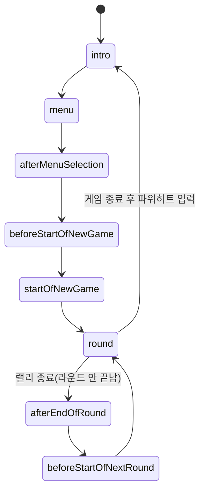

# 01. 게임 루프(틱/프레임) & 상태머신 & 물리엔진

> 이전 문서: [00-overview.md](./00-overview.md) · 다음 문서: [02-input-keyboard.md](./02-input-keyboard.md)

## 1. 한 틱(tick)은 어떻게 도는가

게임의 심장박동은 PixiJS의 `Ticker`다. 정의 위치: [main.js:154-161](../../src/resources/js/main.js#L154-L161).

```js
ticker.maxFPS = pikaVolley.normalFPS; // 25
ticker.add(() => {
  pikaVolley.gameLoop();   // 1) Model 갱신 (Controller 경유)
  renderer.render(stage);  // 2) 화면 렌더링
});
ticker.start();
```

- **게임은 고정 25fps**로 동작한다 (`normalFPS = 25`, [pikavolley.js:54](../../src/resources/js/pikavolley.js#L54)). 원작 오락실/PC 게임의 타이밍을 재현하기 위한 값.
- 슬로우모션(랠리가 끝나고 공이 바닥에 닿는 순간 등) 시에는 `slowMotionFPS = 5`로 체감상 느려지는데, 실제 `ticker` 주기를 바꾸는 게 아니라 [pikavolley.js:120-135](../../src/resources/js/pikavolley.js#L120-L135)의 `gameLoop()`에서 정상 프레임 중 일부를 스킵(`return`)해서 구현한다 — `SLOW_MOTION_FRAMES_NUM = 6`개의 "느린 프레임"을 그리기 위해 `normalFPS / slowMotionFPS = 5`틱마다 한 번만 실제로 진행시킴.
- **한 틱(=한 프레임)에 반드시 일어나는 일** ([pikavolley.js:120-140](../../src/resources/js/pikavolley.js#L120-L140), `gameLoop()`):
  1. `paused` 체크 (일시정지면 아무것도 안 함)
  2. 슬로우모션 스킵 여부 판단
  3. `this.keyboardArray[0].getInput()` / `[1].getInput()` — **이 프레임 동안 쓸 입력을 한 번에 고정(freeze)**. 자세한 내용은 [02-input-keyboard.md](./02-input-keyboard.md).
  4. `this.state()` 호출 — 현재 게임 상태(state)에 해당하는 메서드 실행 (아래 2절)

**"틱/프레임이 어떻게 되어 있는지 확인하려면"** → [pikavolley.js](../../src/resources/js/pikavolley.js)의 `gameLoop()` 메서드와 `frameCounter`/`frameTotal` 필드들을 보면 된다. 대부분의 상태(state) 메서드는 `this.frameCounter++`로 진행 시간을 세고, `this.frameTotal.xxx` 값에 도달하면 다음 상태로 전이한다.

## 2. 상태머신 (Controller의 핵심)

[pikavolley.js](../../src/resources/js/pikavolley.js)의 `PikachuVolleyball` 인스턴스는 `this.state`에 **현재 상태를 나타내는 메서드 자체**를 저장해두고, 매 틱 `this.state()`로 호출한다 (`GameState` 타입 = `function(): void`, [pikavolley.js:13](../../src/resources/js/pikavolley.js#L13)). 각 상태 메서드 안에서 조건을 만족하면 `this.state = this.다음상태` 형태로 직접 상태를 바꾼다.

상태 목록과 정의 위치 (전부 [pikavolley.js](../../src/resources/js/pikavolley.js) 안 메서드):

| 상태 | 위치 | 내용 |
|---|---|---|
| `intro` | [L146](../../src/resources/js/pikavolley.js#L146) | 서류가방 남자 인트로. 파워히트 입력 또는 165프레임 경과 시 `menu`로 |
| `menu` | [L175](../../src/resources/js/pikavolley.js#L175) | With Computer/Friend 선택. 무입력 225프레임 시 컴퓨터끼리 자동 진행 |
| `afterMenuSelection` | [L261](../../src/resources/js/pikavolley.js#L261) | 메뉴 선택 후 페이드아웃 (15프레임) |
| `beforeStartOfNewGame` | [L274](../../src/resources/js/pikavolley.js#L274) | 새 게임 시작 전 딜레이 (15프레임, 원작 재현용) |
| `startOfNewGame` | [L287](../../src/resources/js/pikavolley.js#L287) | 점수 초기화, 공/플레이어 초기화, "Game Start" 메시지 (71프레임) |
| **`round`** | [L330](../../src/resources/js/pikavolley.js#L330) | **실제 경기가 진행되는 상태. 물리엔진이 매 프레임 호출되는 곳** (3절 참고) |
| `afterEndOfRound` | [L415](../../src/resources/js/pikavolley.js#L415) | 한 랠리 종료 후 페이드아웃 (5프레임) |
| `beforeStartOfNextRound` | [L428](../../src/resources/js/pikavolley.js#L428) | 다음 랠리 준비, "Ready" 메시지 (30프레임) |

`gameEnded`/`roundEnded` 플래그와 점수 판정은 `round()` 상태 메서드 내부에서 함께 처리되며 별도 상태로 분리되어 있지 않다 (게임 종료 메시지도 `round()` 안의 `if (this.gameEnded === true)` 분기에서 표시).

대략적인 흐름:



## 3. 물리엔진(Model)은 어디에 있는가

핵심 파일: **[physics.js](../../src/resources/js/physics.js)** (원작 머신코드를 리버스엔지니어링한 결과. 함수별 주석에 원본 주소 `FUN_XXXXXXXX`가 남아있음).

### 3.1 진입점

`round()` 상태([pikavolley.js:330](../../src/resources/js/pikavolley.js#L330)) 안에서 **매 프레임 정확히 한 번** 아래가 호출된다 ([pikavolley.js:346-348](../../src/resources/js/pikavolley.js#L346-L348)):

```js
const isBallTouchingGround = this.physics.runEngineForNextFrame(this.keyboardArray);
```

이것이 [physics.js:88](../../src/resources/js/physics.js#L88) `PikaPhysics.runEngineForNextFrame()`이고, 내부적으로 [physics.js:303](../../src/resources/js/physics.js#L303) `physicsEngine(player1, player2, ball, userInputArray)` 함수 (모듈 내부 함수, export 안 됨)를 호출한다. **엔진을 수정할 때 가장 먼저 열어봐야 할 함수가 이 `physicsEngine`이다.**

### 3.2 핵심 클래스

| 클래스 | 위치 | 설명 |
|---|---|---|
| `PikaPhysics` | [physics.js:70](../../src/resources/js/physics.js#L70) | `player1`, `player2`, `ball`을 묶어 관리하는 최상위 컨테이너 |
| `Player` (모듈 내부) | [physics.js:124](../../src/resources/js/physics.js#L124) | 플레이어(피카츄) 좌표/속도/상태/AI 성향 |
| `Ball` (모듈 내부) | [physics.js:226](../../src/resources/js/physics.js#L226) | 공의 좌표/속도/회전/충돌 상태 |
| `PikaUserInput` | [physics.js:102](../../src/resources/js/physics.js#L102) | 입력 인터페이스(xDirection/yDirection/powerHit). [keyboard.js](../../src/resources/js/keyboard.js)의 `PikaKeyboard`가 이를 상속 |

`Player.state` 값의 의미 ([physics.js:185-192](../../src/resources/js/physics.js#L185-L192)):

```
0: normal, 1: jumping, 2: jumping_and_power_hitting, 3: diving
4: lying_down_after_diving, 5: win!, 6: lost..
```

플레이어의 애니메이션/충돌 판정 분기 대부분이 이 `state` 값 기준으로 나뉘어 있으므로, 새 동작(스킬)을 추가한다면 이 상태값 체계를 확장하는 것이 자연스러운 지점이다.

### 3.3 주요 내부 함수 (모두 [physics.js](../../src/resources/js/physics.js) 내부, export 안 됨)

| 함수 | 위치 | 역할 |
|---|---|---|
| `physicsEngine` | [L303](../../src/resources/js/physics.js#L303) | 한 프레임의 전체 물리 처리 진입점 |
| `processPlayerMovementAndSetPlayerPosition` | [L496](../../src/resources/js/physics.js#L496) | 플레이어 이동/점프/다이빙 처리. 사람 입력이면 그대로, 컴퓨터면 `letComputerDecideUserInput` 호출 |
| `letComputerDecideUserInput` | [L803](../../src/resources/js/physics.js#L803) | **컴퓨터(AI) 플레이어의 의사결정 로직**. `player.computerBoldness`(0~4, 대담함)에 따라 판단이 달라짐 |
| `decideWhetherInputPowerHit` | [L908](../../src/resources/js/physics.js#L908) | AI가 파워히트를 넣을지 결정 |
| `calculateExpectedLandingPointXFor` | [L738](../../src/resources/js/physics.js#L738) | 공의 예상 낙하지점 X좌표 계산 (AI 판단과 공 궤적 예측에 공용으로 쓰임) |
| `isCollisionBetweenBallAndPlayerHappened` | [L381](../../src/resources/js/physics.js#L381) | 공-플레이어 충돌 판정 |
| `processCollisionBetweenBallAndPlayer` | [L678](../../src/resources/js/physics.js#L678) | 충돌 처리(반사 속도 계산 등) |
| `processCollisionBetweenBallAndWorldAndSetBallPosition` | [L398](../../src/resources/js/physics.js#L398) | 공-바닥/네트/벽 충돌 및 좌표 갱신. 반환값이 `round()`가 받는 `isBallTouchingGround` |
| `processGameEndFrameFor` | [L656](../../src/resources/js/physics.js#L656) | 게임 종료(승/패 모션) 프레임 처리 |

### 3.4 좌표계 / 단위 (파일 상단 주석, [physics.js:12-27](../../src/resources/js/physics.js#L12-L27))

- 그라운드: 432(가로) × 304(세로), X는 오른쪽 증가, Y는 아래쪽 증가
- 공 반지름 20, 플레이어 반폭/반높이 32
- 네트 기둥은 그라운드 정중앙 (`GROUND_HALF_WIDTH = 216`)

### 3.5 배경 애니메이션(구름/파도)

[cloud_and_wave.js](../../src/resources/js/cloud_and_wave.js)의 `cloudAndWaveEngine(cloudArray, wave)` ([L65](../../src/resources/js/cloud_and_wave.js#L65))도 마찬가지로 `round()`류 상태에서 `view.game.drawCloudsAndWave()` 호출 시 함께 갱신되는 별도의 작은 물리/애니메이션 로직이다. 경기 로직과는 무관하므로 헷갈리지 않도록 분리해서 기억할 것.

## 4. 요약: "엔진을 고치고 싶다면 어디부터?"

1. 새로운 동작/스킬 추가 → [physics.js](../../src/resources/js/physics.js)의 `Player` 상태값 체계 + `processPlayerMovementAndSetPlayerPosition` ([L496](../../src/resources/js/physics.js#L496))
2. 공 궤적/충돌 규칙 변경 → `processCollisionBetweenBallAndPlayer` ([L678](../../src/resources/js/physics.js#L678)), `processCollisionBetweenBallAndWorldAndSetBallPosition` ([L398](../../src/resources/js/physics.js#L398))
3. AI 난이도/행동 변경 → `letComputerDecideUserInput` ([L803](../../src/resources/js/physics.js#L803)), `decideWhetherInputPowerHit` ([L908](../../src/resources/js/physics.js#L908))
4. 게임 진행/화면 전환(예: 새 게임 상태 추가) → [pikavolley.js](../../src/resources/js/pikavolley.js)의 상태머신 (2절)
5. FPS/슬로우모션 등 타이밍 자체 변경 → [pikavolley.js:53-63](../../src/resources/js/pikavolley.js#L53-L63)의 필드들과 `gameLoop()` ([L120](../../src/resources/js/pikavolley.js#L120))
